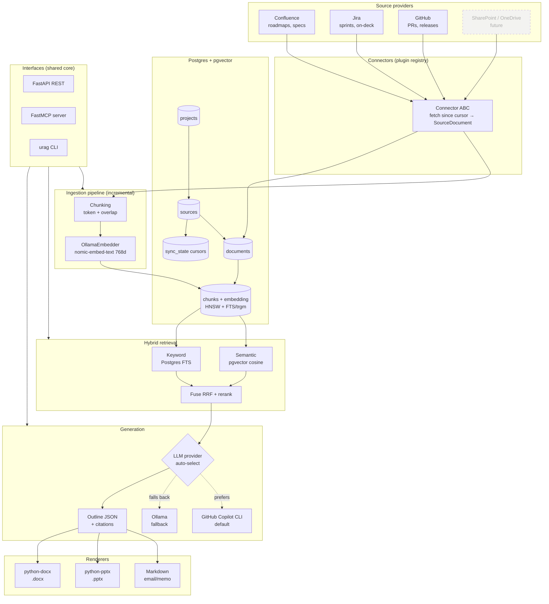

# Architecture

Universal RAG ingests project context from multiple providers into a per-project
pgvector store, then generates citation-grounded business communications.

## Component / data flow



## Project scoping

A **project workspace** (`projects` row) maps to one or more **sources**
(`sources` rows), each bound to a provider and its config (Confluence spaces,
Jira project keys, GitHub repos). Every `chunk` carries denormalized
`project_id` + `source_id`, so retrieval filters to a single project across all
providers in one indexed query — no cross-project bleed.

## Incremental sync

Each source has a `sync_state` cursor (typically a last-modified timestamp).
Ingestion fetches only items changed since the cursor, skips documents whose
`content_hash` is unchanged, re-embeds the rest, and advances the cursor.

## Generation flow

1. `HybridRetriever.search(query, project_id)` → top-K grounded chunks.
2. LLM (Copilot if available, else Ollama) produces a structured **`Outline`**
   with per-claim **citations** back to source chunks.
3. Renderers turn the one outline into Markdown / `.pptx` / `.docx`, keeping
   content and citations consistent across formats.

## Suggested build order

1. `db-init` + Alembic migration (adds FTS/trgm indexes raw DDL).
2. Connectors `fetch()` (start with one provider end-to-end).
3. Chunking + ingestion pipeline + embedder wiring.
4. Hybrid retrieval (semantic → +keyword → +rerank).
5. Generation service + Outline prompt; then renderers.
6. Flesh out FastAPI routers + FastMCP tools over the core.
```
