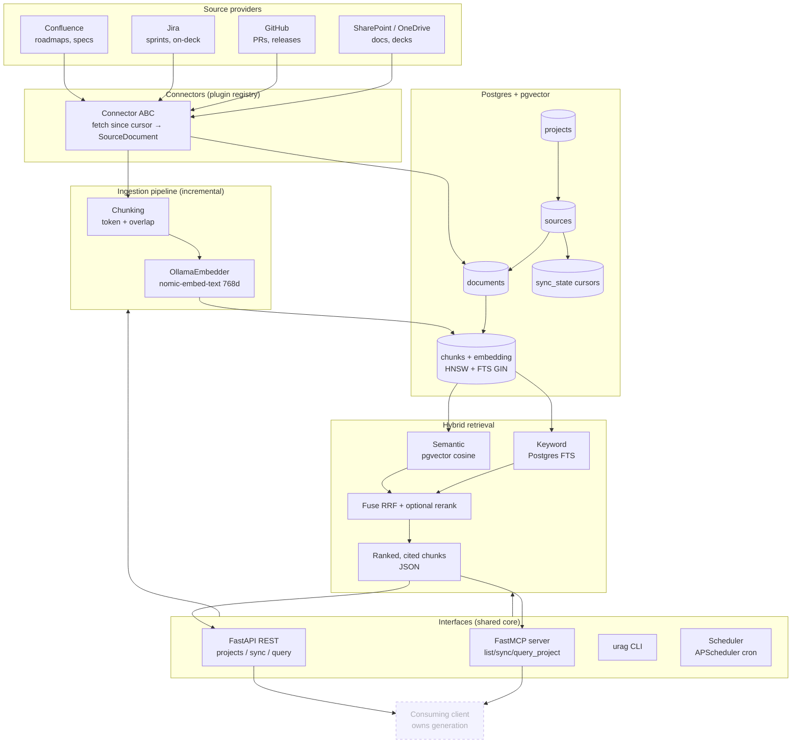
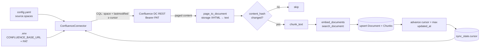
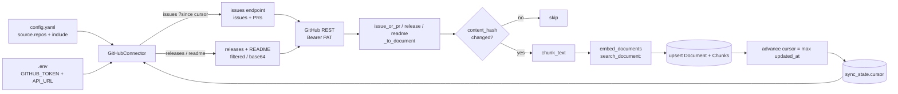
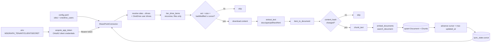
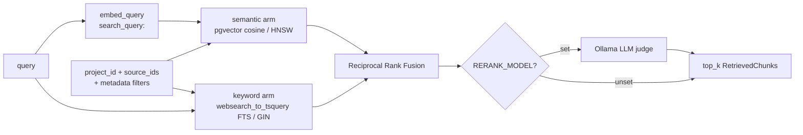

# Architecture

Universal RAG ingests project context from multiple providers into a per-project
pgvector store and serves **project-scoped, citation-ready hybrid retrieval**.
Its responsibility ends at retrieval — **generation is the consuming client's
domain** (clients call `/query` and prompt their own model). There is no LLM
provider or renderer code in this repo.

## Component / data flow



## Project scoping

A **project workspace** (`projects` row) maps to one or more **sources**
(`sources` rows), each bound to a provider and its config (Confluence spaces,
Jira project keys, GitHub repos). Every `chunk` carries denormalized
`project_id` + `source_id`, so retrieval filters to a single project across all
providers in one indexed query — no cross-project bleed.

## Incremental sync

Each source has a `sync_state` cursor (typically a last-modified timestamp).
Ingestion fetches only items changed since the cursor, skips documents whose
`content_hash` is unchanged, re-embeds the rest, and advances the cursor.

## Retrieval surface (where this framework ends)

`HybridRetriever.search(query, project_id)` returns top-K grounded chunks, each
carrying `title` / `url` / `source_id` / `content` / `score`. That payload is
exposed verbatim over:

- **REST** — `POST /projects/{id}/query` (and `.../sync`, `GET /projects`)
- **MCP** — `query_project` / `sync_project` / `list_projects`
- **CLI** — `urag query <project> "<text>"`

A consuming client takes those cited chunks and does whatever it needs (draft an
email, memo, deck, answer a question). **Generation lives entirely on the client
side** — by design, this repo neither prompts an LLM nor renders artifacts.

## Build progress

- [x] `db-init` (tables + pgvector(768) + HNSW). Alembic + FTS/trgm DDL still TODO.
- [x] **Confluence Data Center connector** `fetch()` — CQL incremental, pagination,
      storage→text, PAT bearer auth.
- [x] **Jira Data Center connector** `fetch()` — JQL incremental (`updated >=`),
      startAt/maxResults pagination, summary+description+comments, PAT bearer auth.
- [x] **GitHub connector** `fetch()` — PRs/issues (issues endpoint `?since`),
      releases, README; page-increment pagination, PAT bearer auth.
- [x] **SharePoint / OneDrive connector** `fetch()` — MS Graph app-only OAuth2,
      site/drive resolution, recursive driveItem walk, file text extraction
      (docx/pptx/pdf/text/html), modified-time incremental filter.
- [x] Chunking + ingestion pipeline + embedder wiring (`run_sync`, hash-skip, cursor).
- [x] **Hybrid retrieval** — pgvector cosine + Postgres FTS, RRF fusion, optional
      rerank, project/source/metadata scoping (`HybridRetriever`, `urag query`).
- [x] **Retrieval surface over REST + MCP** — `projects` / `sync` / `query` routes
      and `list_projects` / `sync_project` / `query_project` tools.
- [x] **Generation removed** — out of scope; consuming clients own it.
- [ ] SharePoint **Pages/News** (`/sites/{id}/pages`); deletion handling; Graph
      `/delta`. ← **next slices**
- [x] **Alembic migrations** (`0001_initial`; `db-init` = `alembic upgrade head`).
- [x] **In-process scheduler** (`scheduler.py` / `urag serve-scheduler`) — runs each
      incremental source's `run_sync` on its config cron via APScheduler.

### Confluence ingestion detail (implemented)



### Jira ingestion detail (implemented)

```mermaid
flowchart LR
    CFG[config.yaml<br/>source.projects + jql_extra] --> CONN
    ENV[.env<br/>JIRA_BASE_URL + PAT] --> CONN
    ST[(sync_state.cursor)] --> CONN[JiraConnector]
    CONN -->|JQL: project in (...) + updated ≥ cursor| API[Jira DC REST v2<br/>Bearer PAT]
    API -->|paged issues| PARSE[issue_to_document<br/>summary+description+comments]
    PARSE --> HASH{content_hash<br/>changed?}
    HASH -->|no| SKIP[skip]
    HASH -->|yes| CK[chunk_text] --> EMB[embed_documents<br/>search_document:] --> UP[(upsert Document + Chunks)]
    UP --> ADV[advance cursor = max updated_at]
    ADV --> ST
```

### GitHub ingestion detail (implemented)



### SharePoint / OneDrive ingestion detail (implemented)



### Hybrid retrieval detail (implemented)


